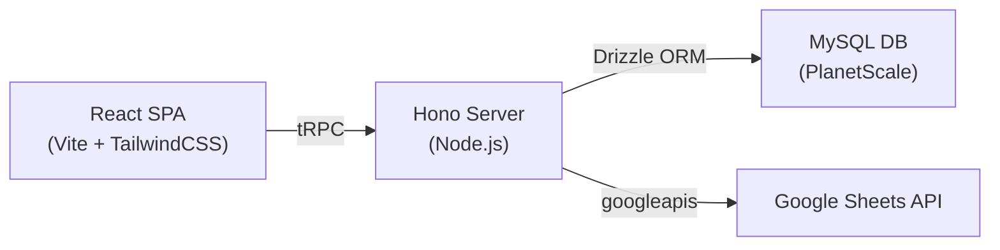

# Advance Fuel Bill Portal — Project Analysis & Deployment Plan

## What This App Does

A **BTS Fuel Bill Tracking Portal** for Grameenphone employees:
1. **Login** via Google OAuth
2. **Email validation** against a whitelist in Google Sheets ("ID Section" tab)
3. **Search** by SL number across "Fuel Bill" and "Petty Cash" tabs
4. **View** bill details + 4-tier (fuel) / 3-tier (petty cash) approval workflow status
5. **Submit** fuel/purchase data which gets appended to a second Google Sheet

---

## Architecture

| Layer | Tech | Purpose |
|-------|------|---------|
| Frontend | React 19 + Vite 7 + TailwindCSS 3 + shadcn/ui | SPA with search & submit forms |
| API | Hono + tRPC + superjson | Type-safe API, JWT sessions |
| Auth | Google OAuth 2.0 + jose JWTs | Cookie-based sessions |
| Database | MySQL (PlanetScale mode) + Drizzle ORM | User management (users table only) |
| Data | Google Sheets API via Service Account | Read bill data, append submissions |

---

## 🔴 Critical Issues for Deployment (No Paid Domain, Multi-User)

### 1. MySQL / PlanetScale Dependency
- **Problem**: The app requires a MySQL database (`DATABASE_URL`). PlanetScale's free tier is discontinued.
- **Solution**: Replace with a **free** alternative:
  - **Turso (SQLite)** — 9 GB free, 500M rows
  - **Neon (PostgreSQL)** — 0.5 GB free
  - **Or** eliminate the DB entirely — the `users` table is only used for session validation / role management. We could store user info in the JWT itself or use Google Sheets as the user registry (which you already partially do with the "ID Section" email whitelist).

### 2. Kimi Auth Dependencies (Dead Code)
- **Problem**: `env.ts` requires `KIMI_AUTH_URL` and `KIMI_OPEN_URL` (lines 21-22), plus `VITE_KIMI_AUTH_URL` and `VITE_APP_ID`. The app uses **Google OAuth only** — these Kimi variables are leftover from the template scaffold.
- **Impact**: In production, the app will crash on startup because these env vars will be missing.
- **Fix**: Remove the `kimiAuthUrl` and `kimiOpenUrl` requirements from `env.ts`.

### 3. Google OAuth Redirect URI
- **Problem**: Without a paid domain, your OAuth callback URL is `https://<your-free-host>/api/oauth/callback`. Google OAuth requires the redirect URI to be registered in the Google Cloud Console.
- **Free host options**: Render (.onrender.com), Railway (.railway.app), Koyeb (.koyeb.app) all give you a stable subdomain. You just register that URL in Google Cloud Console → Authorized redirect URIs.

### 4. Cookie Security (SameSite=None)
- **Problem**: The cookie config sets `sameSite: "None"` and `secure: true` for non-localhost. This is correct for cross-origin but most free hosting gives you a same-origin setup. `SameSite=Lax` would be more appropriate.
- **Low risk** — the current localhost detection handles this, but worth verifying.

### 5. Singleton Sheets Client (Multi-User Safe ✅)
- The Google Sheets client is a singleton (`sheetsClient`). This is fine — the `googleapis` library handles concurrent requests internally. ✅

### 6. Race Condition on Submit (Multi-User ⚠️)
- **Problem**: The `submit` mutation uses `appendToSheet` which appends rows. If two users submit at the exact same time for the same SL, both submissions will be recorded (no deduplication).
- **Severity**: Low — append is atomic in Google Sheets API. Both rows will exist, which may be the desired behavior. But if you need deduplication, you'd need a locking mechanism.

### 7. No Rate Limiting (Multi-User ⚠️)
- **Problem**: No API rate limiting. A user could hammer the search endpoint and exhaust your Google Sheets API quota (100 requests per 100 seconds per user, 500 per project).
- **Fix**: Add `hono/rate-limiter` or a simple in-memory rate limiter.

### 8. Google Sheets API Quota
- **Problem**: Every search reads the **entire** "Fuel Bill" or "Petty Cash" sheet (`A:Z`). With multiple users searching simultaneously, you'll hit the 60 reads/min/user quota quickly.
- **Fix**: Add an **in-memory cache** with a short TTL (30-60 seconds). Sheet data doesn't change every second.

---

## 🟡 Recommended Fixes Summary

| # | Issue | Priority | Effort |
|---|-------|----------|--------|
| 1 | Remove Kimi env vars | 🔴 Critical | 5 min |
| 2 | Replace PlanetScale with Turso/Neon or remove DB | 🔴 Critical | 30-60 min |
| 3 | Add Google Sheets caching | 🟡 High | 20 min |
| 4 | Add rate limiting | 🟡 High | 15 min |
| 5 | Register OAuth redirect for free host | 🟡 High | 10 min |
| 6 | Remove `NODE_ENV=production` Windows incompatibility in `package.json` start script | 🟡 Medium | 2 min |

---

## 🟢 Free Deployment Options (No Paid Domain)

| Platform | Free Tier | Node.js | MySQL/DB | Custom Subdomain | Best For |
|----------|-----------|---------|----------|-------------------|----------|
| **Render** | 750 hrs/mo web service | ✅ | PostgreSQL 90 days free | `app.onrender.com` | Easiest deploy |
| **Railway** | $5 free credit/mo | ✅ | MySQL/Postgres | `app.railway.app` | Has MySQL |
| **Koyeb** | 1 nano service free | ✅ | No (use external) | `app.koyeb.app` | Good perf |
| **Fly.io** | 3 shared VMs free | ✅ | SQLite (LiteFS) | `app.fly.dev` | Best if using SQLite |

> **My recommendation**: Use **Render** (free web service) + **Turso** (free SQLite DB). Simplest path, no credit card required, stable URL for Google OAuth.

---

## 🚀 What I Can Do Next

1. **Clean up the codebase** — Remove Kimi dependencies, fix env vars, fix Windows `NODE_ENV` issue
2. **Add caching + rate limiting** — For multi-user resilience
3. **Switch DB** — From PlanetScale MySQL to Turso SQLite (or remove DB entirely, use JWT-only auth)
4. **Prepare for deployment** — Create `render.yaml` or `fly.toml` for one-click deploy

**Which approach would you like to proceed with?**
